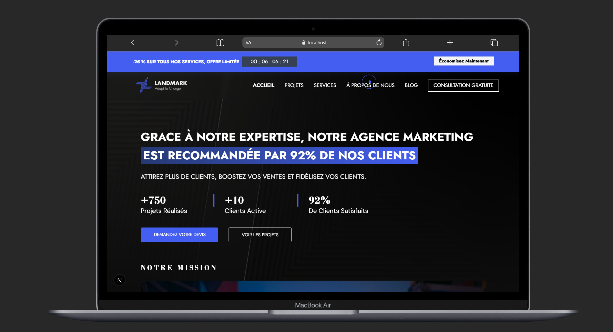

# 📈 Landmark – Marketing Agency Website
<p align="center">
    
</p>

Landmark is a modern, responsive website built for a marketing agency. This project showcases services, client success stories, project portfolios, blog content, and more — all designed with a sleek, professional look and optimized for user experience.

---

## 🚀 Project Overview

This project includes a modern **Next.js (App Router)** front-end. It was originally migrated from a Blade-based (Laravel) project to a modular, component-driven architecture.

- ⚡ **Next.js (App Router)**
- ⚛️ **React**
- 🎨 **Tailwind CSS**
- 👨🏻‍💻 **Laravel**
- 🧩 Modular component structure (reusable components)
- ✅ Follows accessibility best practices and W3C standards

---

## 🧱 Features

- 🔝 Promotion banner for deals or calls-to-action
- 🧭 Responsive Navbar with branding
- 🎯 Hero section with mission & company goals
- 🛠 Services section outlining agency offerings
- 📁 Projects portfolio display
  - Modal project details popup
  - Shimmer placeholders while images are loading
- ✍️ Informative Blog page
- 👤 Client Reviews section
- 📞 Contact form
- ❓ FAQ section
- 👣 Footer with social/contact links
- 🧠 Clean and readable component structure
- 🔎 SEO & performance improvements
   - Metadata improvements (canonical, Open Graph, Twitter)
   - Structured data (JSON-LD) for Blog/Service pages
   - `sitemap.ts`, `robots.txt`, and `site.webmanifest`
   - Next.js `Image` usage for optimized images

---

## 📁 File Structure

```
client/
├── public/
│   ├── robots.txt
│   └── site.webmanifest
└── src/
    ├── app/                       # Next.js App Router routes
    │   ├── layout.tsx
    │   ├── sitemap.ts
    │   ├── blog/
    │   │   ├── page.tsx
    │   │   └── [id]/page.tsx
    │   ├── services/
    │   │   ├── page.tsx
    │   │   └── [id]/page.tsx
    │   └── projects/
    ├── components/                # UI components (Nav, Footer, etc.)
    │   ├── navbar/
    │   └── projects/
    └── services/                  # API helpers
```

---

## 🛠 Getting Started

### Prerequisites

- Node.js (v18+ recommended)
- npm or yarn

### Installation

```bash
git clone https://github.com/LatrachDev/landmark.git
cd landmark/client
npm install
```

### Development Server

```bash
npm run dev
```

Visit `http://localhost:3000` to view the app.

---

## 🧪 Technologies Used
### Front-end
- Next.js (App Router)
- React
- Tailwind CSS
- TypeScript
### Back-end
- Laravel 
### Web design
- Figma (for UI/UX design)
### Other tools
- Git
- GitHub for version control
- Jira for task management

---

## 📌 Project Status

✅ MVP complete  
🔄 Ongoing improvements:   
- Contact form backend integration  
- SEO optimization  
- Accessibility audit

---

## 💡 Inspiration & Goal

Landmark aims to provide a professional online presence for modern marketing agencies. This project focuses on performance, clarity, and effective content structure to convert visitors into clients.

---

## 📷 Preview

> 

---

## 🤝 Contributing

Pull requests are welcome! For major changes, please open an issue first to discuss what you would like to change.

---

## 📄 License

MIT License © 2025 [MOHAMMED LATRACH]

---

## 📬 Contact

For questions or collaborations, reach out to [m.latrach.youcode@gmail.com].
